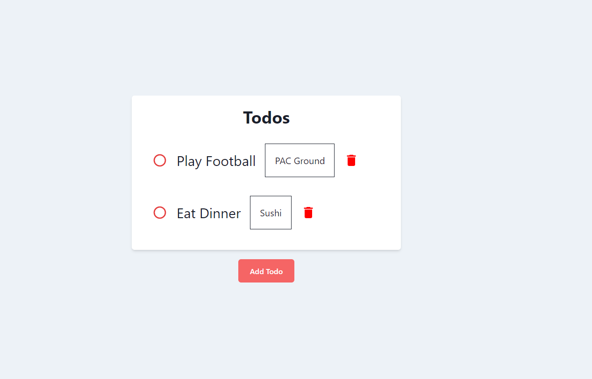

# Todo Application 

### Frontend -  React + TypeScript

### Backend -  GoLang

### Database - MongoDB

- Run the Server 

`cd server`

`go run main.go`

- Run the Client

`cd client`

`npm run dev`

## Update the mongoDb URI in `.env` file and use the format given in `.env.template`

